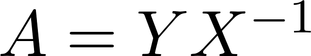
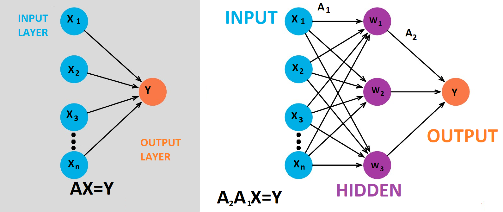
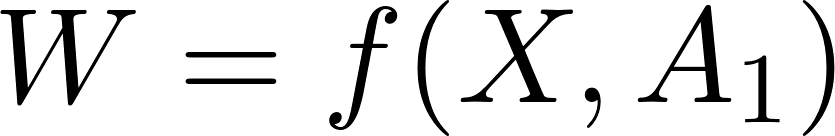
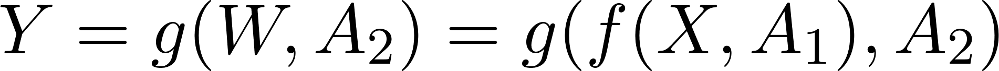
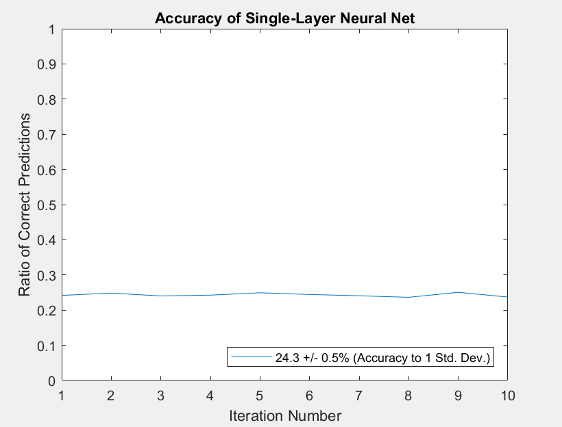
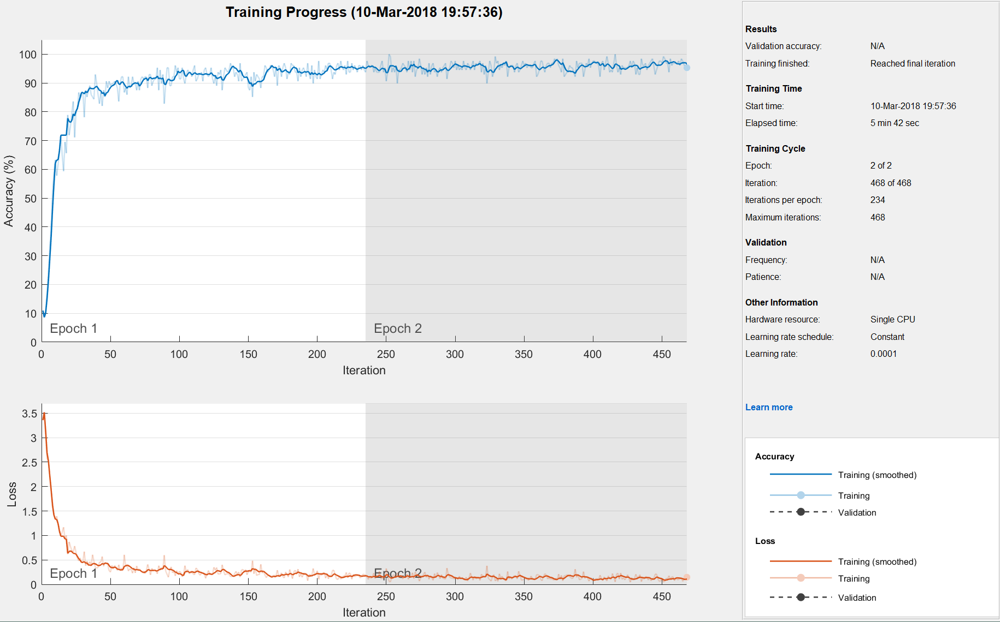
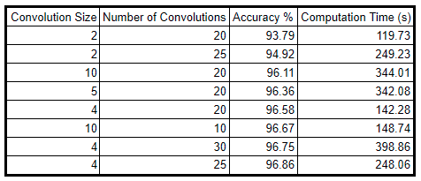

**MNIST Database Handwriting Detection Using Neural-Networks**
========================================

by J. Barhydt1

*University of Washington, Seattle, WA, 98195*

> **Overview:**

> **The use of neural-networks (NNs) has become ubiquitous for machine
> learning tasks involving incredibly large datasets. Like other methods
> of machine learning, neural nets operate by finding underlying
> structure in data through training sets, by being given solutions, or
> labels, to the training sets. The accuracy of the methods are then
> cross-checked and sometimes updated by then running blindly on a test
> set. The labels of the test set are hidden from the code and used to
> verify prediction accuracy. In this paper, several neural network
> topologies (2-layer, multilayer CNN) will be used to perform handwriting
> detection from a database of handwritten and labeled numbers.**

1- This code uses MNIST Database: http://yann.lecun.com/exdb/mnist/

- [Sec.   I. \| Introduction and Overview](#introduction-and-overview)
- [Sec.  II. \| Theoretical Background](#theoretical-background)
- [Sec. III. \| Algorithm Implementation and Development](#algorithm-implementation-and-development)
- [Sec.  IV. \| Computational Results](#computational-results)
- [Sec.   V. \| Summary and Conclusion](#summary-and-conclusions)
- [APPENDIX A\| MATLAB Functions Used](#appendix-a)
- [APPENDIX B\| MATLAB Code](#appendix-b)

# Introduction and Overview
==================================

Only recently have large, labelled datasets been available for building
neural networks, which requires tens of thousands (often many, many more)
images or measurements. The MNIST set (provided by the National
Institute of Standards and technology) is one such seminole database,
containing 42000 small (28x28 pixel) images of handwritten digits, with
corresponding labels. In this paper, a simple single-layer linear neural
net (NN) is constructed to show proof-of-concept, achieving little
better than random guess, as well as a multilayered NN, using a
prepackaged MATLAB NN toolbox, with 7 layers. Comparison between both
accuracy and computation time is made using different configurations of
the MATLAB NN software.

# Theoretical Background
==================================

The concept behind a NN is quite straight-forward, especially for a
single, linear layer. Following Figure 1, the input layer consist of
each measurement set, in our case each one of the bubbles corresponds to
a handwritten letter from the training set. A linear operator is
defined, such that when it acts upon X, an output Y (often called the
perceptron layer) is produced. Thus, building the predictor simply
requires solving for the operator **A**, given by Equation 1.

>  (1)

Then **A** can act upon a new set, the test, to provide a prediction of
Y for the test. The solutions are withheld and used as an accuracy
metric. Adding another allows for nonlinearity in the transformation.
This concept gets expanded much further when allowing functional form to
the transformation stages. For instance, in the case of going from X to
W could form a function based on X and A~1~, following Equation 2. Thus,
the output layer would be described by the composite function given by
Equation 3.

> 

> **Figure 1. (left) Single-Layer Linear Neural Network. (right) 2-Layer
> Linear Neural Network.**

Ultimately, it is the for of Equation 3 is is sought to be minimized in
any NN scheme. As such, the data represents a massively overdetermined
system. Furthermore, there is an enormously broad range of these
transfer functions in use (hyperbolic tan, sigmoid, statistical
mechanics distribution functions, etc) and each is chosen based on the
structure in the underlying data, or sometimes at random from the pool
of successful functions.

>  (2)
>
>  (3)

Additionally, these layers can perform other classifying tasks, such as
windowing, filtering, or random sampling etc. Once a NN has computed
many iterations, it performs backpropagation. Backpropagation occurs in
several steps. During the forward pass, the training image travels
through the network, assigning a first pass of values for the layer
weightings. Then a loss function is calculated on the result. The loss
function is often given by the means squared error of the result.
Finally, a backwards pass can occur, which determines which of the
weights performed the best, or contributed the least, to the loss
function. After the backwards pass is complete, a new set of weightings
can be assigned by means of the learning rate. The learning rate chooses
the step size given to backprop updates. If the learning rate is too
large for the dataset, each jumps will overshoot the 'true value' and
the solutions will not converge. If the learning rate is too low, many
more iterations are required per backpropagation cycle.

A convolutional neural network (CNN) is a popular method applied to the
first hidden layers. In a CNN, a small window is constructed that sweeps
over the image, comparing the feature space to the train. As such, each
image can be decomposed, and the window sliding (convolving) mechanism
checks each image window, by performing element-wise multiplications on
each image feature space with the basis image features. there terms are
summed, leaving a number of sums equal to the window size times the
number of windows. This represents a pooled layer that can act as a
classifier for the underlying image. Often (as is the case in this
paper) the convolution first passes through a ReLU layer, which simply
pops out a zero or a one, signifying whether or not a match was found.
The matches are thenceforth pooled to characterize the image against the
training set.

After the convolutional mapping (and any other process layers) is
complete, it must first pass through a fully connected layer before
reaching the output. This layer matches its input from the previous
layer to the final output, with an equal number of nodes as there are
classes to fit. In our case, there are ten possibilities for what digits
were written down, so the fully connected layer has ten nodes. As an
aside, the minimization scheme chosen for this analysis was a stochastic
gradient descent. Since the dataset is large, the loss computation is
prohibitively expensive. Thus, a small random subset of the training
data (or sometimes a single image) is chosen for each iteration, and its
gradient alone is computed. This makes for a very crude loss estimate,
though after many iterations, the time saved makes up for the error in
the loss function estimate, since the gradient scales like the number of
elements squared..

# Algorithm Implementation and Development
=====================================================

Building the single layer linear network was very straightforward. Once
the data is read, a permutation matrix scrambles the data, so each
training/test run is unique. Solving the linear equation is done by the
pseudo-inverse, and then the solution matrix operates on the test set to
form a prediction. Prediction values are rounded to the nearest digit
for comparison against the true values, and number of nonzeros are taken
from the logical equality of the prediction and solution sets. The
algorithm is ran several times and was cross-validated, yielding
performance statistics from mean and standard deviation.

The multilayered CNN requires quite a bit of art to find the perfect
combination of layers and parameters. Several runs were performed with
varying convolution window sizes, and their performance was collected in
a table for comparison. The layer structure used in the program (which
is very similar to MATLAB's help function tutorial layers/options) was
as follows: The input layer was set to the image size (28 by 28 by 1
pixel), and convolution was performed. The convolution output was sent
through a ReLU layer for binary classification, and then to a pooling
layer to gather the binary result tables and compare against the
training set. A fully connected layer then provided the node space for
all output possibilities (10 nodes), and was sent to a softmax layer,
which provides conditional probabilities to each of the output
possibilities, such that only one value pops out, the predicted
handwritten number. This layer is a more robust version of the round()
function used in the single-layer version, as it uses more of a naive
bayes distribution, to adjust the probabilities based on which inputs
were originally chosen. Finally, these outputs are mapped onto the
classification layer, giving results of one iteration.

Many training set options were explored, and the final code includes
seven such options. First, 'sgdm' defines the minimization algorithm as
stochastic gradient descent. A maximum of 4 epochs was chosen (where an
epoch means that all data in the training set has been processed), and a
batch size of 64 was chosen. the batch is the sample size of each
iteration, taken from the stochastic gradient descent calculation.
Further, validation is performed ever 50 iterations, to ensure
overfitting isn't occurring (as overfitting simply means that the code
fits just one permutation of the training set perfectly, regardless of
whether true underlying patterns have been found. Finally the learning
rate was set to 0.001 and was chosen from observing a few, short test
runs and watching the accuracy convergence rate.

> 

> **Figure 2. Single-Layer Linear Neural Network Handwritten Digit
> Prediction Accuracy**

> 

> **Figure 2. Multi-Layer Convolutional Neural Network Handwritten Digit
> Prediction Accuracy (above) and Loss Function (below) Shown over 468
> Iterations in 2 epochs**

> **(Twenty 5 by 5 Convolution Windows)**

> 

> **Figure 4. Results of Convolution Layer Parameter Scan, Sorted of
> Accuracy**

# Computational Results
=================================

Figure 2 shows results from the simple single layer linear NN. It can be
seen that such a crude network is not much better than random guess,
which would be 1/10. It is no surprise, as the network seeks no
underlying structure, but just slaps a line from input to output. Any
item in the test set that doesn't neatly map to this space will be
easily mis-predicted.

Figure 3 shows results from the CNN, with description given below, while
Figure 4 shows a range of convolution window size options, and their
related results and accuracy. You can see that simply making a smaller
or larger window does not guarantee better results, as such much
fine-tuning is necessary to build the most optimal neural network.

# Summary and Conclusions
==================================

Neural networks are incredibly powerful tools for finding patterns in
huge data sets, and as such have not been used in practice until fairly
recently. They are most certainly not a one-size-fits-all solution, as
the nature of overdetermination means computation time could be much
greater than a simple SVD, if that is all that is needed to find
underlying structure. Additionally, NNs tend to be quite finicky. While
many dimensionality reduction techniques (SVD, POD, PCA, DMD, etc) have
easily tunable parameters, the breadth of the neural network parameter
space leads to a great deal of time fine-tuning the machine to get
outputs that are valuable. For example, with this data set, nearly 40
configurations were tried before settling on exploring the convolution
space. with SVD or DMD, once the code is complete, there is often only
one parameter (rank) that needs tuning. Neural nets are impressive in
their ability to continue to 'churn out' better and better predictions,
but it is their incredible overdetermination that set them back at
times.

# APPENDIX A 
(MATLAB Functions Used / Description With Example)
=============================================================

The trainNetwork function build into MATLAB is briefly explained in the
paper, with parameters, layers and options used for this particular run,
however much more detail is given in the developer website, linked
below.

https://www.mathworks.com/help/nnet/ref/trainnetwork.html\#inputarg\_options

# APPENDIX B 
(MATLAB Code)
========================

\% Neural Network Handwriting analysis

\% Johnathon R Barhydt

\% AMATH 482 HW5

\%

\% This code builds training and test sets from the MNIST database to

\% classify handwriten digits 0-9 using both a single layer linear NN
and a

\% multiplayer CNN

\%

clear all, close all, clc

\%% 1-Layer NN

\% number of trials

perms = 20;

\% grab training/test data and combine for cross-validation

data=csvread(\'train.csv\',1,0).\';

\% cross-validation of NN over several iterations

for i=1:perms

\%scramble data for cross validation

perm=randperm(size(data,2));

data\_mixed=data(:,perm);

\%grab training inputs and labels

X=data\_mixed(2:end,1:30000);

Y=data\_mixed(1,1:30000);

\% solve for A

A=Y\*pinv(X);

\% test 1-layer NN

\% grab test inputs and labels

X\_test=data\_mixed(2:end,30001:end).\';

Y\_test=data\_mixed(1,30001:end).\';

\% solve for Y

Y\_predict=round(A\*X\_test.\');

\% accuracy check

Acc=(Y\_predict==Y\_test.\');

accuracy(i)=nnz(Acc)/size(Acc,2);

end

\%% plot accuracy results

\% cross validation result statistics

u\_accuracy=round(100\*mean(accuracy),1);

s\_accuracy=round(100\*std(accuracy),2);

result = strcat(num2str(u\_accuracy),\" +/- \",num2str(s\_accuracy),\"%
(Accuracy to 1 Std. Dev.)\");

figure(1)

plot(accuracy)

set(gca,\'Ylim\',\[0 1\])

title(\'Accuracy of Single-Layer Neural Net\')

ylabel(\'Ratio of Correct Predictions\')

xlabel(\'Iteration Number\')

legend(result,\'Location\',\'southeast\')

\%% multilayer NN

\% 7 layer burrito! the recipe (order) is up to you

\%\-\-\-\-\-\-\-\-\-\-\-\-\-\-\-\-\-\-\-\-\-\-\-\-\-\-\-\-\-\-\-\-\-\-\-\-\-\-\-\-\-\-\-\-\-\-\-\-\-\-\-\-\-\-\-\-\-\-\-\--

\%img is 28 by 28, grayscale, reshape training and test sets

X\_sq=reshape(X,\[28 28 1 30000\]);

X\_test\_sq=reshape(X\_test.\',\[28 28 1 12000\]);

layers = \[imageInputLayer(\[28 28 1\]);

\%important! only take a little window of the photo, slide the window
across

\%(looks for edges) perform bunch of functions to each window

convolution2dLayer(5,20);

reluLayer();

maxPooling2dLayer(2,\'Stride\',2);

fullyConnectedLayer(10);

softmaxLayer();

classificationLayer()\];

options = trainingOptions(\'sgdm\',\...%stochastic gradient descent
method

\'MaxEpochs\',2,\... % runtime cutoff \--\> less backprop updating

\'Plots\',\'training-progress\',\...%plot results

\'MiniBatchSize\',64,\...%take smaller samples each iter

\'ValidationData\',{X\_test\_sq,categorical(Y\_test)},\...

\'ValidationFrequency\',50,\...

\'InitialLearnRate\',0.0001); %start slow

\%(batch gradient descent will grab more than one sample for each
update)

rng(\'default\') % For reproducibility

net = trainNetwork(X\_sq,categorical(Y),layers,options); %data labels
layers options

Y\_predict = classify(net,X\_test\_sq);

accuracy = sum(Y\_predict == categorical(Y\_test))/numel(Y\_test)
